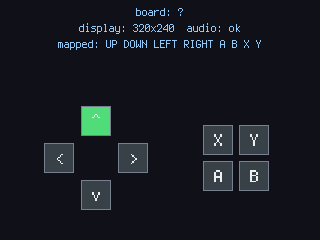

# Postav si vlastní desku

picogame může běžet i na desce, kterou si zapojíš sám. Potřebuje **SPI displej, několik
tlačítek a firmware s modulem picogame**. Hotové buildy najdeš na stránce
[Podporovaný hardware](../supported-hardware.md), případně si můžeš sestavit vlastní. Tento návod
používá holé **Raspberry Pi Pico** (nebo Pico W / Pico 2) a samostatný displej.

## Zapoj to

Toto je pinová mapa PicoPadu. Její použití vyžaduje nejméně nastavení, ale můžeš zvolit i jiné
vhodné GPIO a pojmenovat je v `settings.toml`. Schémata: [Hardware Pajenicko
PicoPad](https://github.com/Pajenicko/Picopad/tree/main/hardware/schematics).

| Funkce | Pico GPIO | Poznámky |
|---|---|---|
| Displej **SCK** | GP18 | SPI hodiny |
| Displej **MOSI** | GP19 | SPI data (na SDA/DIN displeje) |
| Displej **DC** | GP17 | data/příkaz |
| Displej **CS** | GP21 | chip select |
| Displej **RST** | GP20 | reset |
| Displej **BL** | GP16 | podsvícení (připojit na napětí nebo PWM pro stmívání) |
| **↑ Nahoru** | GP4 | tlačítko na **GND** (aktivní v nule, interní pull-up) |
| **↓ Dolů** | GP5 | |
| **← Vlevo** | GP3 | |
| **→ Vpravo** | GP2 | |
| **A** | GP7 | |
| **B** | GP6 | |
| X / Y *(volitelné)* | GP9 / GP8 | |
| **Reproduktor** | GP15 | PWM audio, přes malý tranzistor/zesilovač nebo piezo |
| Displej **VCC / GND** | 3V3 / GND | i společný vodič pro tlačítka a reproduktor |

Tlačítka jsou zapojená **na GND** a čtou se jako aktivní v nule s interním pull-upem. Sběrnice
ST7789 může běžet až na **62,5 MHz**. Na nepájivém poli použij krátké vodiče k displeji;
při potížích sniž `PICOGAME_BAUD`.

## Tři způsoby, jak dát enginu displej

Hra si o obrazovku řekne přes `picogame_game.screen()` / `picogame_game.display()`. Ty čtou
`supervisor.runtime.display` — **primární displej** desky, který CircuitPython nastaví, když ho
vytvoří firmware, a který si `boot.py` nebo spouštěč zveřejní sám. Jinudy se displej ke hře
nedostane (simulátor a hřiště v prohlížeči mají vlastní malý shim `supervisor`), takže úkol je
jediný: displej jednou postavit a zveřejnit. **Vyber si jednu cestu:**

1. **Deska už `board.DISPLAY` má** (PicoPad, PicoSystem, µGame, Thumby, VIDI X). Zkopíruj
   hru jako `code.py` a moduly, které importuje, do `lib/`.
2. **Firmware picogame pro *vlastní desky***: build pro **Pico / Pico W / Pico 2 / Pico 2 W**
   ([ke stažení](../supported-hardware.md)) mají místo pro `board.DISPLAY`. Krátký **`boot.py`** vytvoří
   displej podle `settings.toml` a hra zůstane **beze změny jako `code.py`**. Postup funguje i pro
   existující hry a hry postavené na `stage`. **Po nakopírování `boot.py` jednou stiskni RESET**
   (nebo odpoj a připoj USB): `boot.py` běží jen při zapnutí — uložení souboru spustí `code.py`,
   ale `boot.py` ne, takže do restartu je `board.DISPLAY` `None` a hra spadne s
   `AttributeError: 'NoneType' object has no attribute 'width'`.
3. **Jiný firmware** bez místa pro displej. Spouštěcí `code.py` vytvoří displej, zveřejní ho přes
   `supervisor.runtime.display = disp` a potom spustí hru uloženou jako `game.py`.

Hotový `boot.py` nebo spouštěč vezmi z
[`custom_board/` v repu](https://github.com/MakerClassCZ/picogame/tree/main/custom_board). Každá cesta
má svou složku; použij jednu. Ovladač displeje je **v Pythonu** (inicializační tabulka je přímo
v souboru), takže přidání nového řadiče nevyžaduje nový build firmwaru.

## Nastav to — jedno `settings.toml`

Obě ne-nativní cesty (i hra samotná) čtou **stejné `settings.toml`**. Jeden soubor popisuje celou desku:

```toml
# Displej
PICOGAME_DISPLAY = "st7789"        # nebo "ili9341"
PICOGAME_PINS    = "SCK=GP18 MOSI=GP19 DC=GP17 CS=GP21 RST=GP20 BL=GP16"
PICOGAME_SIZE    = "320x240"       # ŠÍŘKA x VÝŠKA; ŠÍŘKA > VÝŠKA = orientace na šířku
PICOGAME_FLIP    = ""              # "", "h", "v", "hv" — orientace (viz níže)
PICOGAME_INVERT  = 0               # negativní barvy? -> přepni 0/1 (panely ST7789 mají obě polarity)
# Na STOCK PicoPad firmwaru navíc (varianty panelu bez přestavby displeje):
# PICOGAME_MADCTL = 0x68           # absolutní orientační bajt: 0x60 stock | 0x68 BGR | 0xA0 montáž 180° | 0xA8 obojí
# PICOGAME_BRIGHTNESS = 80         # jas podsvícení v procentech (celé číslo 0-100)
PICOGAME_BGR     = 0               # prohozené R/B? -> 1
PICOGAME_BAUD    = 24000000        # sniž při dlouhých vodičích na nepájivém poli

# Tlačítka (aktivní v nule, na GND) — zápis je LOGICKÉ=GPpin
PICOGAME_BUTTONS = "UP=GP4 DOWN=GP5 LEFT=GP3 RIGHT=GP2 A=GP7 B=GP6 X=GP9 Y=GP8"

# Audio (volitelné)
PICOGAME_AUDIO   = "GP15"          # pin PWM reproduktoru; vynech, když žádný není
```

Zapojení tlačítek pak můžeš měnit v nastavení bez úpravy herního kódu. Spouštěcí varianta navíc
čte `PICOGAME_GAME = "game"`, aby věděla, který modul má spustit.

:::note[Varianta boot.py: přidal jsi boot.py nebo změnil nastavení displeje? Udělej plný restart]
Ve variantě s **`boot.py`** se displej vytvoří pouze při zapnutí. Platí to tedy **hned po prvním
nakopírování `boot.py`** i po úpravě klíče displeje
(`PICOGAME_DISPLAY`, `PICOGAME_PINS`, `PICOGAME_SIZE`, `PICOGAME_FLIP`, `PICOGAME_INVERT`, `PICOGAME_BGR`,
`PICOGAME_BAUD`) stiskni **RESET** nebo znovu připoj USB. Měkký restart po uložení souboru
spustí znovu `code.py`, ale ne `boot.py`, a nastavení displeje proto zůstane staré. Nastavení
tlačítek a zvuku čte hra při každém běhu. Spouštěcí varianta vytváří displej při každém běhu,
takže v ní se změny projeví i po měkkém restartu.
:::

## Kompletní reference `settings.toml`

Klíče výše pokrývají běžný případ. Níže je každý **runtime** klíč, který picogame čte. Všechny se
čtou za běhu, takže desku přizpůsobíš **bez nového flashe** — klíč se projeví po dalším restartu
(klíče displeje vyžadují plný restart, viz poznámka výše). Hodnoty jsou **jen celá čísla nebo
řetězce**: `settings.toml` v CircuitPythonu nezná desetinná čísla ani booleany, takže zapnuto/vypnuto
je `1`/`0` a hlasitost je **celé číslo v dB**.

| Klíč | Formát / hodnoty | Příklad | Poznámka |
|---|---|---|---|
| `PICOGAME_PULL` | `"up"` nebo `"down"` | `PICOGAME_PULL = "up"` | Interní rezistor + aktivní úroveň pro **všechna** tlačítka. `up` = zapojeno na GND, stisk čte nulu (výchozí); `down` = zapojeno na 3V3, stisk čte jedničku. |
| `PICOGAME_MATRIX_ROWS` | GP piny (mezera/čárka) | `"GP0 GP1 GP2 GP3"` | Řádkové piny skenované klávesové matice (viz úvod níže). |
| `PICOGAME_MATRIX_COLS` | GP piny (mezera/čárka) | `"GP4 GP5 GP6 GP7"` | Sloupcové piny matice. |
| `PICOGAME_MATRIX_MAP` | tokeny `NÁZEV=řádek,sloupec` | `"UP=1,2 A=3,5 START=0,0"` | Mapuje buňky matice na herní tlačítka. Přijímá i `NÁZEV=číslo_klávesy` (`klávesa = řádek*počet_sloupců+sloupec`). Namapuj jen klávesy, které chceš; zbytek se ignoruje. |
| `PICOGAME_MATRIX_ANODES` | `"cols"` nebo `"rows"` | `"cols"` | Volitelné; kterou osu řídit. Výchozí `cols`; přepni na `rows`, když je obrácený směr diod. |
| `PICOGAME_AUDIO_OUT` | `"headphone"` / `"speaker"` / `"both"` | `"headphone"` | Volba výstupu pro I2S DAC (Fruit Jam TLV320). Výchozí `headphone`. |
| `PICOGAME_HP_VOLUME` | celé číslo v dB, `<= 0` | `-10` | Analogové doladění sluchátek. `0` = linková úroveň (příliš hlasité do sluchátek — drž `<= -3`); `-78` = ticho. Bez klíče lib nastaví `-10`. |
| `PICOGAME_DAC_VOLUME` | celé číslo v dB, `<= 0` | `-3` | Hlavní digitální fader. Drž `<= 0`, aby DSP neořezával. |
| `PICOGAME_SPK_VOLUME` | celé číslo v dB, `<= 0` | `-10` | Analogové doladění reproduktoru (stejná škála jako sluchátka). |
| `PICOGAME_USB` | `1` / `0` | `PICOGAME_USB = 0` | Na buildu s USB hostem `0` **vypne** automatické připojení USB HID vstupu (gamepad + klávesnice). Výchozí zapnuto. |
| `PICOGAME_USBPAD` | tokeny `NÁZEV=bajt:maska` | `"A=5:0x40 B=5:0x20"` | Přemapuje tlačítka gamepadu (index bajtu HID reportu : bitová maska). Částečný seznam se sloučí přes výchozí hodnoty DragonRise. |
| `PICOGAME_USBPAD_ID` | `"VID:PID"` (hex) | `"081f:e401"` | Připne USB gamepad na konkrétní zařízení (přeskočí autovýběr), když je připojeno víc HID zařízení. |
| `PICOGAME_USBPAD_TIMEOUT` | ms | `10` | Timeout čtení HID pro poll gamepadu. Zvyš jen, když pad zahazuje vstupy. |
| `PICOGAME_KBD` | `1` / `0` | `PICOGAME_KBD = 0` | `0` vypne pouze USB **klávesnici** (gamepad se stále připojí). Výchozí zapnuto. |
| `PICOGAME_USBKBD` | tokeny `NÁZEV=keycode` | `"A=0x2C START=0x28"` | Přemapuje klávesy USB klávesnice na tlačítka hry (HID keycode, hex nebo dekadicky). Sloučí se přes výchozí rozložení šipky/WASD. |
| `PICOGAME_USBKBD_EP` | `"iface:endpoint"` | `"2:0x83"` | Nasměruje driver klávesnice na živé rozhraní / IN endpoint combo donglu, jehož boot rozhraní mlčí (najdeš přes `tools/usbkbd_probe.py`). |
| `PICOGAME_USBKBD_TIMEOUT` | ms | `10` | Timeout čtení HID pro poll klávesnice. |
| `PICOGAME_DEBUG` | `1` / `0` | `PICOGAME_DEBUG = 1` | **Když něco nefunguje, nastav tohle.** Vypíše důvody selhání `[picogame] ...` (audio DAC/ovladač, USB pad/klávesnice, …) na sériovou konzoli. Po vyřešení odeber. |

**Tlačítka v klávesové matici.** Pokud jsou tvoje tlačítka zapojená jako skenovaná mřížka
**řádek × sloupec** (malá klávesnice nebo QWERTY blok) místo jednoho pinu na tlačítko, použij klíče
`PICOGAME_MATRIX_*` výše místo `PICOGAME_BUTTONS`. Na herní tlačítka namapuj jen buňky, o které stojíš.
Souřadnice `(řádek, sloupec)` (nebo číslo klávesy) každé buňky zjistíš spuštěním **`matrix_probe.py`** —
vypíše je, jak tiskneš.

**USB gamepad.** Na firmwaru s USB hostem (Fruit Jam) se pad připojený do portu USB-HOST připojí
automaticky **bez úpravy hry**; výchozí rozložení je generický pad DragonRise `081f:e401`. Nastavením
`PICOGAME_USB = 0` to vypneš, nebo tlačítka jiného padu přemapuješ přes `PICOGAME_USBPAD` (jeho bajty
reportu zjistíš USB sondou).

:::note[Tohle jsou build flagy, ne nastavení]
Výstup DVI/framebuffer, 12bitové barvy RGB444 a rychlý (DMA) backend displeje jsou **volby firmwaru
při kompilaci** (`CIRCUITPY_PICOGAME_FRAMEBUFFER`, `CIRCUITPY_PICOGAME_RGB444`,
`CIRCUITPY_PICOGAME_FAST_DISPLAY`), **ne** klíče `settings.toml` — nehledej runtime klíč. Pro build
s nimi viz [Firmware](../firmware.md).
:::

## Když je obraz špatně

picogame kreslí přímo do panelu, takže orientace je v nastavení panelu, ne v softwarové rotaci.
Následující hodnoty měň v `settings.toml`; herní kód upravovat nemusíš:

| Projev | Řešení |
|---|---|
| Na bok / špatný poměr stran | prohoď `PICOGAME_SIZE` (`320x240` ↔ `240x320`) |
| Vzhůru nohama | `PICOGAME_FLIP = "hv"` |
| Zrcadlově (text pozpátku) | `PICOGAME_FLIP = "h"` (nebo `"v"` při svislém překlopení) |
| Negativní barvy | `PICOGAME_INVERT = 1` |
| Prohozená červená a modrá | `PICOGAME_BGR = 1` |

Moduly displejů se liší. Měň vždy jednu hodnotu a zkontroluj výsledek. ST7789 často používá
`INVERT = 1` a ILI9341 často `BGR = 1`, ale správná hodnota závisí na konkrétním modulu.

## Nejdřív zkontroluj zapojení: `input_example`

Před svou hrou nahraj na desku **`input_example.py`** (v `examples/` v repu). Na sériovou konzoli vypíše,
co picogame zjistil — identifikátor desky, velikost displeje, namapovaná tlačítka a zvuk — a nakreslí D-pad + A/B/X/Y
jako čtverce, které se při stisku **rozsvítí a pípnou**. Nenamapované tlačítko zůstane tmavé, takže chybu
v zapojení nebo `settings.toml` poznáš na první pohled.



## Pak nasaď jako obvykle

Jakmile displej i tlačítka reagují, všechno ostatní — nasazení `.mpy`, rozpočet RAM, flashování — je
stejné jako u kterékoli desky: viz [Spuštění na hardwaru](../hardware.md).
