# picogame example games

Click a game to play it in your browser — or copy it to a PicoPad. These are the games that ship with picogame.

## Try a game

**▶ In your browser — easiest, nothing to install.** Click any game below. It opens in the
[Playground](/playground/) and starts right away. Keys: **arrows** (or WASD) move, **F** (or Ctrl) = button A,
**G** = button B.

**💻 On your computer.** Download the code once, then run a single line — the desktop simulator opens
a window:

```bash
git clone https://github.com/MakerClassCZ/picogame
cd picogame
python3 sim/run.py demos/picogame_snake.py    # any demo/game
```

You need Python 3 (add `pip install pygame` for a live window; without it the run just saves a screenshot).

**🎮 On real hardware.** Any Raspberry Pi Pico with a small screen, a few buttons and a buzzer plays
these — a ready-made **PicoPad**, or one you [build yourself](hardware.md). Flash the firmware, copy the
game's files, done.

## The games

<div class="pg-cards">
  <a class="pg-card" href="/playground/?game=cavern"><span class="thumb">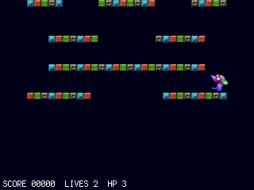<span class="play"></span></span><span class="meta"><b>Platformer</b><small><code>picogame_cavern</code></small><span class="run">▶ play in browser</span></span></a>
  <a class="pg-card" href="/playground/?game=picobike"><span class="thumb">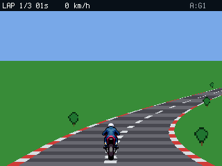<span class="play"></span></span><span class="meta"><b>Pseudo-3D racer</b><small><code>picogame_picobike</code></small><span class="run">▶ play in browser</span></span></a>
  <a class="pg-card" href="/playground/?game=squest_full"><span class="thumb">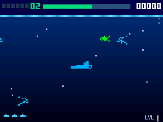<span class="play"></span></span><span class="meta"><b>Vertical shooter</b><small><code>picogame_squest_full</code></small><span class="run">▶ play in browser</span></span></a>
  <a class="pg-card" href="/playground/?game=picowing"><span class="thumb">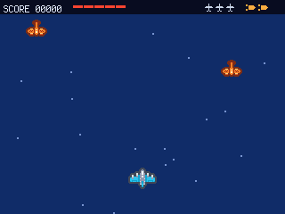<span class="play"></span></span><span class="meta"><b>Plane shmup</b><small><code>picogame_picowing</code></small><span class="run">▶ play in browser</span></span></a>
  <a class="pg-card" href="/playground/?game=quest"><span class="thumb">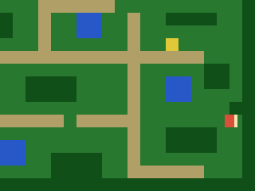<span class="play"></span></span><span class="meta"><b>Top-down RPG</b><small><code>picogame_quest</code></small><span class="run">▶ play in browser</span></span></a>
  <a class="pg-card" href="/playground/?game=picatro"><span class="thumb">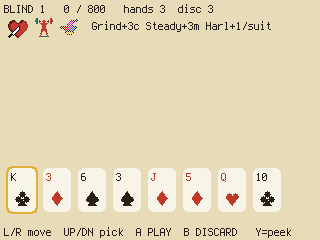<span class="play"></span></span><span class="meta"><b>Card roguelite</b><small><code>picogame_picatro</code></small><span class="run">▶ play in browser</span></span></a>
  <a class="pg-card" href="/playground/?game=train"><span class="thumb"><span class="play"></span></span><span class="meta"><b>Logic puzzle</b><small><code>picogame_train</code></small><span class="run">▶ play in browser</span></span></a>
  <a class="pg-card" href="/playground/?game=corona"><span class="thumb">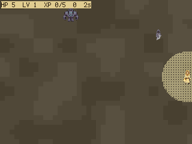<span class="play"></span></span><span class="meta"><b>Survivor arena</b><small><code>picogame_corona</code></small><span class="run">▶ play in browser</span></span></a>
  <a class="pg-card" href="/playground/?game=salvo"><span class="thumb">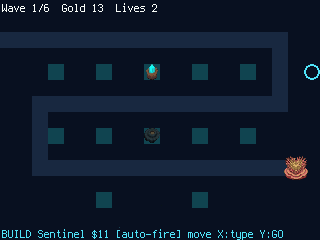<span class="play"></span></span><span class="meta"><b>Tower defense</b><small><code>picogame_salvo</code></small><span class="run">▶ play in browser</span></span></a>
  <a class="pg-card" href="/playground/?game=platformer"><span class="thumb">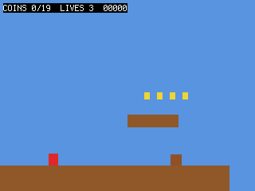<span class="play"></span></span><span class="meta"><b>Side-scroller</b><small><code>picogame_platformer</code></small><span class="run">▶ play in browser</span></span></a>
  <a class="pg-card" href="/playground/?game=pacman"><span class="thumb">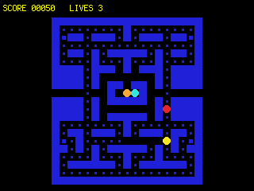<span class="play"></span></span><span class="meta"><b>Maze chase</b><small><code>picogame_pacman</code></small><span class="run">▶ play in browser</span></span></a>
  <a class="pg-card" href="/playground/?game=picotris"><span class="thumb">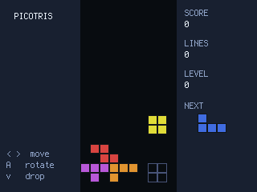<span class="play"></span></span><span class="meta"><b>Falling-block puzzle</b><small><code>picogame_picotris</code></small><span class="run">▶ play in browser</span></span></a>
  <a class="pg-card" href="/playground/?game=arkanoid"><span class="thumb">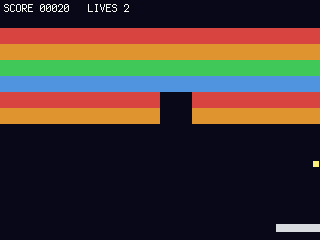<span class="play"></span></span><span class="meta"><b>Breakout</b><small><code>picogame_arkanoid</code></small><span class="run">▶ play in browser</span></span></a>
  <a class="pg-card" href="/playground/?game=asteroids"><span class="thumb">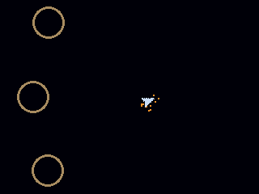<span class="play"></span></span><span class="meta"><b>Asteroids</b><small><code>picogame_asteroids</code></small><span class="run">▶ play in browser</span></span></a>
  <a class="pg-card" href="/playground/?game=snake"><span class="thumb">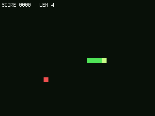<span class="play"></span></span><span class="meta"><b>Snake</b><small><code>picogame_snake</code></small><span class="run">▶ play in browser</span></span></a>
  <a class="pg-card" href="/playground/?game=picoracer"><span class="thumb">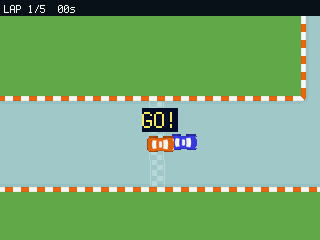<span class="play"></span></span><span class="meta"><b>Top-down racer</b><small><code>picogame_picoracer</code></small><span class="run">▶ play in browser</span></span></a>
  <a class="pg-card" href="/playground/?game=soccer"><span class="thumb">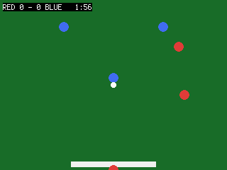<span class="play"></span></span><span class="meta"><b>Sports</b><small><code>picogame_soccer</code></small><span class="run">▶ play in browser</span></span></a>
  <a class="pg-card" href="/playground/?game=pinball"><span class="thumb">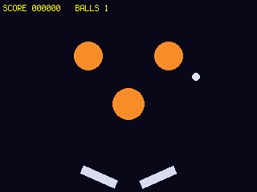<span class="play"></span></span><span class="meta"><b>Pinball</b><small><code>picogame_pinball</code></small><span class="run">▶ play in browser</span></span></a>
  <a class="pg-card" href="/playground/?game=match3"><span class="thumb">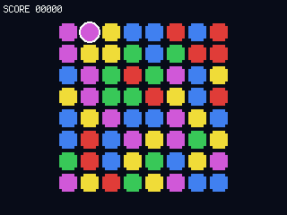<span class="play"></span></span><span class="meta"><b>Match-3</b><small><code>picogame_match3</code></small><span class="run">▶ play in browser</span></span></a>
  <a class="pg-card" href="/playground/?game=dinorun"><span class="thumb">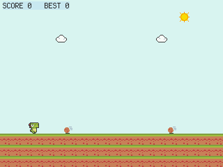<span class="play"></span></span><span class="meta"><b>Endless runner</b><small><code>picogame_dinorun</code></small><span class="run">▶ play in browser</span></span></a>
  <a class="pg-card" href="/playground/?game=flappy"><span class="thumb">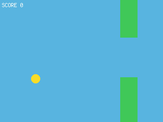<span class="play"></span></span><span class="meta"><b>Flappy</b><small><code>picogame_flappy</code></small><span class="run">▶ play in browser</span></span></a>
  <a class="pg-card" href="/playground/?game=starfall"><span class="thumb">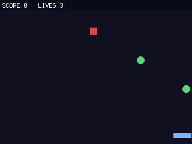<span class="play"></span></span><span class="meta"><b>Catch arcade</b><small><code>picogame_starfall</code></small><span class="run">▶ play in browser</span></span></a>
  <a class="pg-card" href="/playground/?game=missile"><span class="thumb">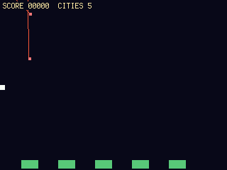<span class="play"></span></span><span class="meta"><b>Missile defense</b><small><code>picogame_missile</code></small><span class="run">▶ play in browser</span></span></a>
  <a class="pg-card" href="/playground/?game=zoom"><span class="thumb">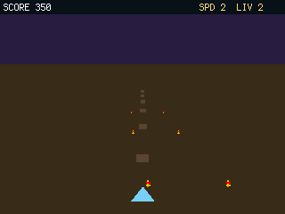<span class="play"></span></span><span class="meta"><b>Pseudo-3D gates</b><small><code>picogame_zoom</code></small><span class="run">▶ play in browser</span></span></a>
</div>

Every game is one self-contained program, and its opening comment lists exactly what it uses — so it
also works as a template: start from the closest one and reshape it. They all live in the
[picogame repo](https://github.com/MakerClassCZ/picogame).

## Put a game on a device

1. Flash `firmware.uf2` — steps on [Run on hardware](hardware.md).
2. Copy the game's `code.py` onto the CIRCUITPY drive, plus the helper modules and any asset files it
   imports (each game's header comment lists them).

Power-cycle and it runs.
