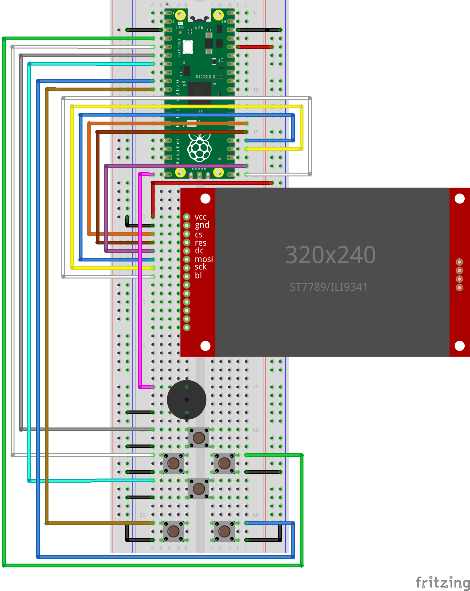

# Supported hardware

picogame is a native module inside a CircuitPython fork, so it runs on boards with **a picogame
firmware build** - which needs an SPI display, a few buttons, and (optionally) a PWM speaker. Boards
below have builds; other CircuitPython boards with an SPI display can be ported (see
[Build your own board](custom-board.md)). The reference device everything is tuned and measured
against is the PicoPad.

## Devices

| Device | MCU | Notes |
|---|---|---|
| **Pajenicko PicoPad** | RP2040 | **Primary / reference device.** 320×240 ST7789, D-pad + A/B/X/Y, speaker, SD, NVM. A prebuilt firmware and button profile are provided. |
| PicoPad 2 / RP2350 boards | RP2350 | Build-only (not yet verified on this hardware). Same layout and a larger heap than the RP2040 builds. |
| ESP32-S3 boards (e.g. Feather TFT) | ESP32-S3 | Build-only (not yet verified on this hardware). Wire the buttons for your board (see below). |
| Desktop simulator | your PC | A development tool rather than a hardware target. It runs the same game-facing API but does not reproduce device RAM limits or timing. |

The engine is a native C module in a CircuitPython fork. PicoPad has a **prebuilt firmware**; for other
boards you build the fork for that board, see [The firmware build](firmware.md).

## Download firmware

Each link below is a firmware build for one board. Flash it, then copy `code.py` and the
required `lib/` modules from [picogame-libs](https://github.com/MakerClassCZ/picogame-libs).

:::caution[Check the status of your board]
The **PicoPad** firmware is the reference build and is tested on the device. Builds without a
specific tested status in the table are experimental and may need board-specific work. For a
reproducible release, build the CircuitPython fork for the exact board and commit you use (see
[The firmware build](firmware.md)).
:::

| Board | Firmware |
|---|---|
| **Pajenicko PicoPad** (RP2040) — *tested* | [`picopad.uf2`](/firmware/picopad.uf2) |
| PicoPad 2 (RP2350) — *DIY* | [`picopad2.uf2`](/firmware/picopad2.uf2) |
| PicoPad 2 W (RP2350) — *DIY* | [`picopad2w.uf2`](/firmware/picopad2w.uf2) |
| Pimoroni PicoSystem (RP2040) | [`picosystem.uf2`](/firmware/picosystem.uf2) |
| µGame22 (RP2040) | [`ugame22.uf2`](/firmware/ugame22.uf2) |
| Raspberry Pi Pico (RP2040) | [`pico.uf2`](/firmware/pico.uf2) |
| Raspberry Pi Pico W (RP2040) | [`pico_w.uf2`](/firmware/pico_w.uf2) |
| Raspberry Pi Pico 2 (RP2350) | [`pico2.uf2`](/firmware/pico2.uf2) |
| Raspberry Pi Pico 2 W (RP2350) | [`pico2_w.uf2`](/firmware/pico2_w.uf2) |
| TinyCircuits Thumby Color (RP2350) | [`thumby_color.uf2`](/firmware/thumby_color.uf2) |
| **Adafruit Fruit Jam** (RP2350B, **DVI/HDMI out**) — *tested: DVI display, TLV320 audio, USB input, launcher* | [`fruitjam.uf2`](/firmware/fruitjam.uf2) |
| ESP32-S3 — generic (Adafruit Feather TFT) | [`feather_s3.uf2`](/firmware/feather_s3.uf2) |
| µGame S3 (ESP32-S3) | [`ugame_s3.uf2`](/firmware/ugame_s3.uf2) |
| VIDI X (ESP32) | [`vidi_x.bin`](/firmware/vidi_x.bin) |

*The two **PicoPad 2** builds are **DIY / unofficial**, for a PicoPad whose Pico module has been
swapped for a Pico 2 / Pico 2 W (RP2350). There is no official Pico 2 PicoPad product and no official
CircuitPython for it: same PicoPad hardware, just more RAM (~520 KB heap). Use at your own risk.*

*The **Fruit Jam** build renders through the DVI framebuffer instead of an SPI panel, and is a
well-tested platform — DVI rendering, TLV320 audio, USB gamepad/keyboard input and the on-device
launcher all run on hardware. Configure it in
`settings.toml` (`CIRCUITPY_DISPLAY_WIDTH`/`_HEIGHT`/`_ROTATION`) with one of two colour depths —
`setup()` handles either automatically: `CIRCUITPY_DISPLAY_COLOR_DEPTH=16` for full-colour RGB565
(e.g. 320×240), or `=8` for RGB332, the only depth picodvi offers at **640×480** (full resolution).
See [Run on hardware](hardware.md) for the framebuffer/colour-depth details.
**Audio** on the Fruit Jam is the I2S TLV320 DAC — install `adafruit_tlv320` + `adafruit_bus_device`
in `CIRCUITPY/lib` (they aren't bundled) and raise the volume keys, or it's silent; `PICOGAME_DEBUG=1`
prints why. **Input** is a USB gamepad or keyboard (the board has no game buttons) — see
[Input & controls](/helpers/input/).*

**Flashing:** put the board in bootloader mode. Pico/PicoPad: hold **BOOTSEL** while connecting USB
(or double-tap **RESET**) → an `RPI-RP2` USB drive appears → drag the `.uf2` onto it → it reboots as
`CIRCUITPY`. Then copy your `code.py` + the `lib/` modules it imports. On a bare Pico, also wire a
display + buttons and build the display in code (see *Build your own* below).

**About `.mpy` files:** a game folder may hold an **`mpy/`** subfolder. Those are **compiled
MicroPython modules** (the game's data/asset modules run through `mpy-cross`): they import faster,
take less storage, and, most importantly on a tiny-RAM board, skip the parse-time RAM spike a large
`.py` causes at import. **On hardware, copy the `mpy/` files next to `code.py`** (not the loose `.py`
assets); the loose `.py` are the source the **simulator** runs directly. Same idea as the shipped
`lib/*.mpy` engine helpers.

The **classic ESP32** (VIDI X) ships a `.bin` flashed with `esptool` (no UF2 bootloader); ESP32-**S3**
boards still use drag-and-drop UF2.

:::note[Display, sound, and button setup]
**Screen and sound auto-map** wherever the board firmware exposes them; picogame takes the screen the board provides (`picogame_game.screen()`) and the output picked by `picogame_audioout` (a PWM speaker pin, or an I2S DAC where the board has one), which the onboard-screen handhelds here (PicoSystem, µGame22, µGame S3, Thumby Color, VIDI X) define. So on those the screen lights up with no setup; sound works if the board names a speaker pin (otherwise pass one: `picogame_audio.Audio(pin)`). On an **I2S DAC board (Fruit Jam)** install `adafruit_tlv320` + `adafruit_bus_device` and set the volume keys, or it stays silent — see [Audio & music](/helpers/audio/).

**Buttons** map automatically on boards with a picogame profile: **PicoPad, PicoSystem, µGame22,
µGame S3, and Thumby Color**. **VIDI X** needs separate handling because its D-pad uses an analog
resistor ladder, and unlisted boards need an explicit map. On a **USB-host board (Fruit Jam)** a USB
gamepad or keyboard is the input (auto-attached; see [Input & controls](/helpers/input/)). Set a GPIO
map in `settings.toml` without rebuilding the firmware; `picogame_input.py` contains profiles you can
use as examples:

```toml
PICOGAME_BUTTONS = "UP=GP4 DOWN=GP5 LEFT=GP3 RIGHT=GP2 A=GP7 B=GP6 X=GP9 Y=GP8"
```

On a board with **no onboard display** (a bare Pico), you also build the display in code. Both steps are shown in *Build your own → Bring-up* below.
:::

## What a board needs

- **A CircuitPython-supported MCU** — RP2040, RP2350 or ESP32-S3 are the tested families.
- **RAM** usually sets the asset budget. The current measured builds provide about **190 KB** of
  heap on RP2040 and **520 KB** on RP2350; the largest contiguous block is smaller and varies with
  firmware configuration. Measure your build (see [Fit it in RAM](memory.md)).
- **An SPI display** driven by `displayio` (or a DVI/HSTX framebuffer on RP2350 boards like the Fruit Jam).
- **A few buttons** on GPIO — a D-pad + A/B is the baseline; X/Y are optional. Or a USB gamepad/keyboard on a USB-host board.
- **Optional: a PWM-capable pin** for a small speaker, **or an I2S DAC** (sound is opt-in).

## Displays

picogame uses the `displayio` SPI display stack. The controllers listed below are the current
tested or supported targets; other `displayio` SPI displays may need verification.

- **Resolution is flexible, if the game reads it.** 320×240 is the reference size. The engine and
  `Scene` render to whatever size the display reports, but a game has to *lay itself out* from that
  size rather than hardcode 320×240: read `picogame_game.screen()` and derive your layout from
  it. The `arkanoid` example does exactly that (brick width = display width ÷ columns), so the **same
  file runs on 240- and 320-px** screens. Less width/height just means a smaller play area.
- **Controllers:** **ST7789** is the reference (PicoPad). **ST7735** (smaller panels) and **ILI9341**
  also work, as do other `displayio`-supported SPI controllers.
- **12-bit colour (RGB444):** the firmware can send 12-bit instead of 16-bit to cut SPI traffic on
  transfer-bound scenes. It is an opt-in, compile-time capability: the default everywhere is RGB565,
  and a game enables 12-bit only where the board advertises it (`picogame.RGB444_SUPPORTED`, e.g.
  `rgb444="auto"` in `picogame_game.setup`). Requesting `rgb444=True` on a build without the support
  raises an error rather than mis-driving the panel (ST7789/ST7735 have COLMOD 12-bit, ILI9341 does
  not). Details in [Clocks, SPI & display limits](hardware-limits.md).

## Build your own on a breadboard

No board from the list? A picogame console is cheap to build yourself. The minimum is:

- a **Raspberry Pi Pico** — Pico 1, Pico W or **Pico 2** all work;
- a **320×240 SPI display** with an **ST7789** or **ILI9341** controller;
- **at least 6 buttons** — a D-pad + A/B (add X/Y for two more);
- a small **piezo buzzer** for sound (optional).

That's enough to play everything on this site. The full pin map, the three ways to get
`board.DISPLAY`, the `settings.toml` button config, and orientation/colour troubleshooting are in
**[Build your own board](custom-board.md)**.



Wire the display's `vcc / gnd / cs / res / dc / mosi / sck / bl`, the six buttons and the piezo as
shown. The exact GPIO pins and the matching `settings.toml` button map are on
[Build your own board](custom-board.md); a build video is on the way.
