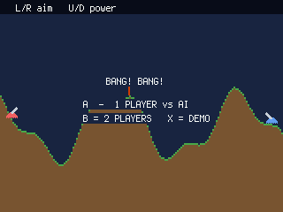
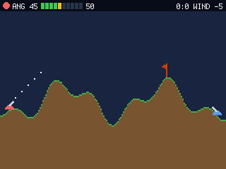
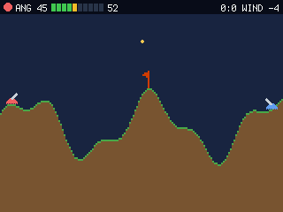

# Bang! Bang!

A **turn-based artillery duel** for the PicoPad — two tanks lob shells at each other across
destructible hills, in the Scorched Earth / Gorillas tradition. Set your **angle** and **power**,
read the **wind**, and blow the other tank off the map. Play the AI or a friend hot-seat.

> Genre: artillery / turn-based · Players: 1 (vs AI) or 2 (hot-seat) · Session: 2–10 min · Controls: D-pad + A/B





## The idea
Two tanks, one hill-strewn battlefield, and a shell that arcs under gravity and drifts on the wind.
Each turn you tune two numbers — the **angle** you point the barrel and the **power** you fire with —
then watch the shot trace its parabola. Miss, and you've handed the enemy your range. Hit, and the
blast **craters the terrain**, reshaping the battlefield for the next shot. It's simple to grasp and
deep to master: a duel of read-adjust-fire where the ground itself keeps changing.

## Quick rules
- Two tanks take **turns**. On your turn, **aim** (angle) + set **power**, then **fire**.
- The shell arcs under gravity and is pushed by the **WIND** (shown top-right; a windsock flies on a
  central peak — watch which way and how hard it leans).
- A direct hit destroys the enemy tank and **wins the round**; the running score **P1 : P2** ticks up
  and a fresh battlefield (new terrain + new wind) is dealt.
- Explosions **erode the terrain** into craters — use them to dig a boxed-in enemy out, or reshape
  your own cover.

## Controls
Works on any board with a D-pad + **A** and **B** (no X/Y needed to play).

| Screen | Input | Action |
|---|---|---|
| Title | **A** | 1 player vs AI |
| Title | **B** | 2 players (hot-seat) |
| Play | ←/→ | aim the barrel (angle) |
| Play | ↑/↓ | more / less power |
| Play | **A** or **B** | FIRE |

## Run it
```sh
python3 sim/run.py games/bangbang/code.py --backend pygame
```
On device, copy `code.py` into the game slot (art is procedural — no asset files needed).
