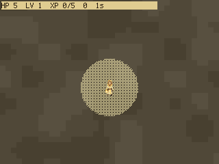
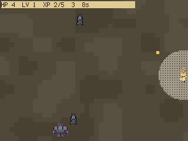
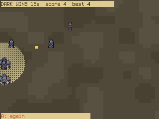

# Corona

**Lantern-Bearer vs the Dark** — a horde-survivor for the PicoPad. You only *move*; your lantern
fires itself. Beasts pour in from the dark edges, kills scatter XP embers that your glow drags in,
and every level-up hands you one of three upgrades. How long do you hold the light?

> Genre: horde survivor / action · Players: 1 · Session: 2–5 min · Controls: D-pad + X (dash) + A





## The idea
The arena is bright bone-gold; the beasts are cool and dark, so they read at a glance even when the
screen fills up. Your Lantern-Bearer is the only warm, bright thing on it — the light **auto-fires**
at whatever comes closest, so all your attention goes into *positioning*: kite the swarm, keep the
elites at arm's length, and steer your glow over the embers the kills leave behind. The glow is both
your weapon's reach and your **XP magnet**, which turns "where do I stand" into the whole game.

## Quick rules
- **Move** with the D-pad; the lantern fires on its own. You never aim.
- Kills drop **XP embers**; anything inside the glow is pulled in. Elites drop two.
- Filling the XP bar **levels you up**: the dark recoils, time stops, and you pick **1 of 3**
  upgrades — `DMG+50%`, `RATE+` (faster shots) or `SPEED+` (faster walk).
- **Dash** (X) gives a short burst with **i-frames** — the way out of a closing ring; it has a
  cooldown, so it's an escape, not a travel move.
- Beasts come in four flavours (creeper, skitterer, brute, shade) and get tougher each level.
  Taking a hit costs HP; at zero the dark wins and the run ends — **A** starts another.

## Controls
Works on any board with a D-pad + **A** and **X**.

| Button | Action |
|---|---|
| D-pad | move |
| X | dash (brief invulnerability) |
| A | confirm an upgrade · restart after a run |

## Run it
On a device: copy the whole folder into the game slot — or use a
[quick-start pack](../../README.md). In the desktop simulator:

```sh
python3 sim/run.py games/corona/code.py --backend pygame
```
