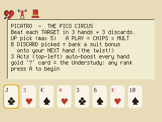
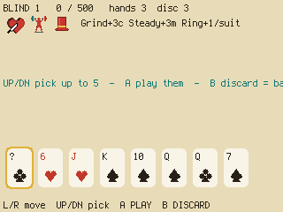
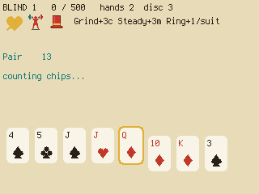
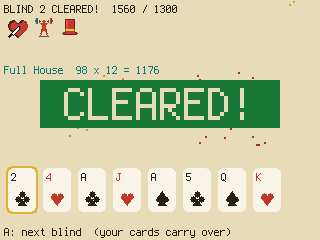

# Picatro — The Pico Circus

A **poker deckbuilder** for the PicoPad. Play the best poker hands to beat five rising score
targets — but the twist is the **discard**: throwing cards away *banks* a bonus onto your next
hand. Time your banking, hoard your best cards across blinds, and put on a show.

> Genre: card / puzzle · Players: 1 · Session: 5–15 min · Controls: D-pad + A/B






## The idea
Each hand scores **CHIPS × MULT**. That's easy. The depth is in the **discard**: instead of just
cycling bad cards, every card you discard banks a bonus by its suit onto your **next** hand —
hearts add chips, diamonds add mult, clubs multiply your mult, spades dig you an extra card. So a
"wasted" turn spent discarding is really you **loading a cannon** to fire on the next hand.

On top of that: unplayed cards **carry over** between blinds (no shop — you hoard good cards for the
hard targets), three always-on **Acts** bend your scoring, and once per run a wild **Understudy**
card can become any rank you need.

## Quick rules
- Beat **5 blinds**; each has a **target** you must reach in **3 hands** (+ **3 discards**).
  Targets: **800 / 1800 / 2800 / 3600 / 4200**.
- **Pick up to 5 cards → PLAY** → they score as a poker hand (**CHIPS × MULT**).
- **DISCARD** picked cards to **bank a bonus** onto your next hand: ♥ +4 chips · ♦ +1 mult ·
  ♣ ×mult · ♠ dig +1 card.
- **3 Acts** boost every hand: **Grinder** (+3 chips/card), **Steady** (+3 mult), **Harlequin**
  (+1 mult per *extra suit* — rewards variety).
- **Carry-hand**: cards you don't play carry into the next blind — save a great card for a hard one.
- **The Understudy** (the gold **"?"** card, once per run): becomes whatever *rank* scores best
  (never a Straight Flush; its suit is fixed).

Clearing **3 of 5 blinds is already a good run** — the circus is a tough crowd.

📖 **Full rules & scoring tables: [RULES.md](RULES.md)** (English + Česky)

## Controls
Works on any board with a D-pad + **A** and **B** (no X/Y needed).

| Input | Action |
|---|---|
| ←/→ | move the cursor |
| ↑ | pick the card (up to 5) |
| ↓ | unpick |
| **A** | PLAY the picked cards |
| **B** | DISCARD them (bank a bonus) |
| **A** | continue, on result screens |

## Run it
```sh
python3 sim/run.py games/picatro/code.py --backend pygame
```
On device, copy `code.py` + `picatro_art.py` into the game slot.
