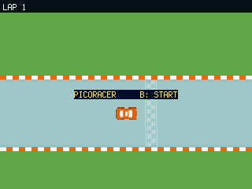
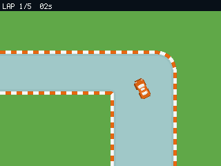
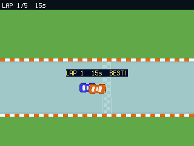
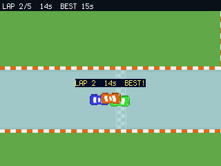

# PicoRacer — Race Your Own Ghosts

A **top-down arcade racer** for the PicoPad. Drive a hand-laid tarmac circuit for **5 laps** — but
the twist is the **ghost**: every lap you finish comes back as a **replay car** on the next lap. By
the final lap you're wheel-to-wheel with **four ghosts of your own earlier laps**, and the only rival
worth beating is yourself.

> Genre: racing / arcade · Players: 1 · Session: 2–5 min · Controls: D-pad + A/B






## The idea
It's a solo race, so who do you race? **Yourself.** The engine records every lap you drive, then
replays it as a coloured **ghost car** on the following lap. Finish lap 1 and a **blue** ghost — the
exact line you just drove — falls in behind you. Lap 2 adds **green**, lap 3 **yellow**, lap 4
**black**. On the last lap all five cars are on track at once, each a perfect echo of one of your
earlier laps.

That turns a lonely time-trial into a duel with your past self. Drive a tidy lap and its ghost is a
tough pace car to chase; blow a corner and you get to overtake your own mistake next time round. The
car handles like an arcade racer: gradual acceleration up to top speed, real **grip** — steer hard at
speed and you **understeer**, so you lift or brake into the tight corners — and **grass** that grabs
you and bleeds off speed if you run wide.

## Quick rules
- A race is **5 laps** around one circuit. Beat your own **best lap** time.
- After each of laps 1–4 a **ghost car** joins — a looping replay of that lap of yours. The final
  lap has **all 5 cars** (you in red + four ghosts).
- Each lap only counts if you reach the **far-left checkpoint** and then cross the **finish line
  driving the right way** — no cheating by rolling back over the line.
- **Grass slows you down.** Stay on the tarmac to keep your speed.
- A **new best lap** flashes your car white and pops a **BEST!** banner.

📖 **Full rules: [RULES.md](RULES.md)** (English + Česky)

## Controls
Works on any board with a D-pad + **A** and **B** (no X/Y needed).

| Input | Action |
|---|---|
| ←/→ | steer left / right |
| **B** | gas (accelerate) |
| **A** | brake, then reverse |
| **B** | START / race again (on the title & finish screens) |

## Run it
```sh
python3 sim/run.py games/picoracer/code.py --backend pygame
```
On device, copy `code.py` + `picoracer_track.py` + `race_cars.py` into the game slot (plus the
`picogame_*` helper libs). Track & car art are from the CC0 **Kenney Racing Pack**.
