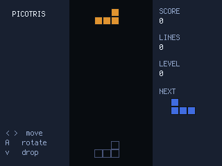
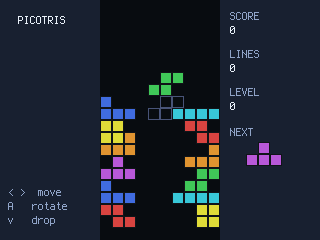
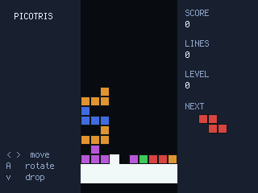

# Picotris — Falling Blocks on the Pico

A **Tetris-style** block-stacker for the PicoPad. Seven tetromino shapes rain into a 10-wide well;
slide and rotate each one to pack complete rows. Fill a row all the way across and it **flashes and
clears** — the higher your level, the faster they fall.

> Genre: falling-block puzzle · Players: 1 · Session: endless · Controls: D-pad + A





## The idea
Every piece is one of the seven classic tetrominoes (**I O T S Z J L**), handed to you by a **7-bag**
shuffler — you get all seven once before any repeats, so there are no cruel droughts or streaks. A
faint **ghost** shows exactly where the current piece will land, and a **NEXT** box tells you what's
coming, so you can plan two moves ahead.

Clear **10 lines** and you go up a **level**; every level makes the pieces fall faster (ten speed
steps in all). Clearing **four rows at once** — a *Picotris* — is worth far more than four singles,
so the real game is deciding when to keep stacking for the big clear and when to play it safe.

## Quick rules
- Pieces fall into a **10 × 18 well**. Move and rotate to fit them together.
- Fill a **complete horizontal row** and it clears; everything above drops down.
- **Soft-drop** (hold ↓) speeds a piece to the bottom for points and pace.
- Score is best when you clear **multiple rows in one drop** — 1/2/3/4 lines pay
  **40 / 100 / 300 / 1200**, multiplied by your current level.
- Every **10 lines** = **+1 level** = faster gravity.
- Stack to the top and there's no room to spawn → **game over**, and a fresh well starts.

## Controls
Works on any board with a D-pad + **A** (no B/X/Y needed).

| Input | Action |
|---|---|
| ←/→ | move the piece left / right |
| **A** | rotate the piece (clockwise) |
| ↓ | **soft-drop** — fall fast while held |

There's no hard-drop and no hold-piece: it's the pure, classic stack.

## Run it
```sh
python3 sim/run.py games/picotris/code.py --backend pygame
```
On device, copy `code.py` into the game slot — it needs only the on-board `picogame` libraries.
