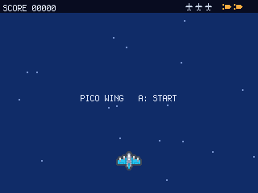
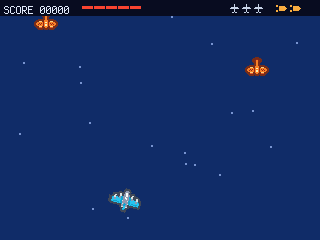
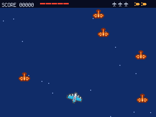
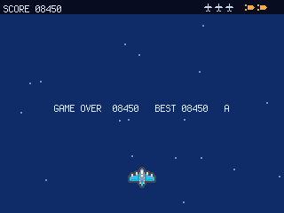

# Pico Wing

A **vertical shmup** for the PicoPad. You are the last interceptor holding the sky; raiders pour
down from above. Move, hold the trigger to autofire, and build a **KILL CHAIN** multiplier — but let
one raider slip past you and the whole chain resets. Greed versus safety, three lives, instant restart.

> Genre: arcade / shmup · Players: 1 · Session: 3–10 min · Controls: D-pad + A/B






## The idea
Every kill you land bumps a **kill chain**. Every 5 links in the chain raises your **score
multiplier** (x2, x3, x4…), so a hot streak is worth far more than the same kills scattered. That's
the greed. The catch: any raider that reaches the **bottom of the screen** breaks the chain and drops
your multiplier back to x1 — no life lost, just your streak. So the real game isn't "shoot things",
it's **let nothing through** while your multiplier climbs.

On top of that, your gun **overheats**. Hold the trigger forever and it locks up mid-swarm; short,
timed bursts keep it cool. And when a wave is about to overrun you, spend a **panic bomb** — it
clears the whole screen (and vents the gun). You start with two, and earn one more every 10 000 points.

## Quick rules
- **3 lives.** A raider that touches your ship costs a life (you get mercy invulnerability after each
  hit). Lose all three → game over → press **A** to restart instantly.
- **Autofire by holding A** — but the gun **overheats**. The heat gauge in the HUD fills as you fire;
  at full it **locks** and you must release the trigger to cool it down. Fire in bursts.
- **Kill chain:** each kill adds a link; your **multiplier = 1 + (chain ÷ 5)** — so every 5th kill in
  a streak bumps you to x2, x3, x4…. Each kill scores **50 × your multiplier**.
- **A raider that slips off the bottom resets the chain** (multiplier back to x1). Costs no life —
  but it's the whole tension: chase the big multiplier or play it safe.
- **Panic bomb (B):** clears every raider on screen, shakes the screen, and vents the gun. Start with
  **2**, cap of **3**, earn one every **10 000 points**.
- Raiders speed up and spawn faster over time (with a short breather between waves). Some **dive** —
  they bank toward you instead of falling straight.

📖 **Full rules & scoring: [RULES.md](RULES.md)** (English + Česky)

## Controls
Works on any board with a D-pad + **A** and **B** (no X/Y needed).

| Input | Action |
|---|---|
| ←/→/↑/↓ | fly the ship (8-directional) |
| **A** (hold) | autofire (watch the heat gauge) |
| **B** | panic bomb — clear the screen |
| **A** | start, on the title screen |
| **A** | restart, on game over |

## Run it
```sh
python3 sim/run.py games/picowing/code.py --backend pygame
```
On device, copy `code.py` + `plane.py` + `enemy.py` into the game slot.
