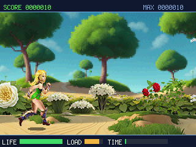
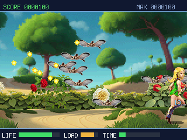
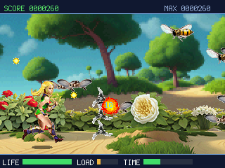

# Pictor

**A meadow, a running girl, and a sky full of insects.** Jill runs, jumps and throws shuriken;
press B and she becomes a bird that flies free and spits seeds twice as fast. A port of Miroslav
Němeček's *Pictor* from [PicoLibSDK](https://github.com/Panda381/PicoLibSDK), with the original art.

> Genre: run-and-gun · Players: 1 · Session: 1–3 min · Controls: D-pad + A (shoot) + B/X (transform)

## The idea
Two forms, one button apart. **Jill** is grounded: gravity, jumps, and a slow three-way volley that
rewards standing your ground. **Bird** trades the ground for the whole screen and a fast seed hose,
but she is bigger and takes more from every hit. The level runs on a timer, the swarm thickens
towards the end, and the score lives on across runs — so the question is always whether to spend
the last seconds farming the swarm or playing safe.

## Quick rules
- **Move** with the D-pad. As Jill, **UP** jumps; as the bird, up/down fly.
- **A** shoots. Jill throws a spinning three-shuriken spread on a slow reload; the bird spits single
  seeds fast. Both shots pierce until their charge runs out.
- **B** or **X** transforms. The new form starts with an empty reload, so you cannot dodge a
  reload by switching.
- Insects fly patterned paths and shoot back. Contact and bullets both cost HP — the bar at the
  bottom left. The middle bar is your reload, the right one the level timer.
- At zero HP the run ends; **A** starts a new one. Your best score is kept.

## Controls
| Button | Action |
|---|---|
| D-pad | move (UP = jump as Jill, up/down = fly as the bird) |
| A | shoot |
| B / X | transform Jill ↔ bird |

## How it runs on a small board
The three parallax layers are 90 KB of pixels — far more than an RP2040 has spare. They ship as
small row-strip files under `assets/`, and on firmware with `picogame.xip_map()` each strip is
blitted **straight out of flash**, so the backgrounds cost no RAM at all and all three layers run,
middle layer at the original 640×64. On older firmware (or in the simulator) the strips are read
into RAM instead: ground and foreground fit, the middle layer is dropped, and a scrolling seam
fills its band. Same for Jill's and the bird's animation sheets — mapped from flash when possible,
streamed a frame at a time when not.

## Credits
Original game, art and design: **Miroslav Němeček** (PicoLibSDK, Panda381). This is a port to
picogame with his art converted to the engine's PAL8 format; the code is a re-implementation.
