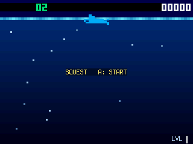
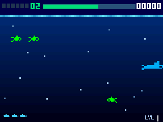
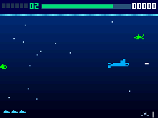
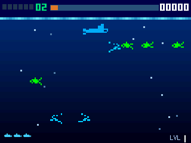

# Squest — Seaquest for the PicoPad

A **fast underwater shooter** for the PicoPad. Pilot a submarine, shoot the fish, and **rescue
divers** — but your **oxygen is always draining**, so every run is a race between the six divers you
need and the surface you have to keep coming back to. From level 3 the enemy subs start **shooting
back**.

> Genre: arcade shooter · Players: 1 · Session: 3–10 min · Controls: D-pad + A/B






## The idea
It's a **push-your-luck dive**. Diving deep is where the points and the divers are — but the deeper
you stay, the more **oxygen** you burn, and the only way to refill is to swim all the way back up to
the **surface**. So every trip down is a gamble: *one more fish, one more diver… or turn back now
before the tank runs dry?* Cut it too fine and you **drown** — that's a life gone, same as ramming a
fish.

The divers are the real objective. You need **six** to clear a level, but you usually can't grab all
six on one tank of air — so they **carry over** between dives and even across deaths. When you finally
surface carrying the full six, you deliver them and the level is done. From **level 3** the sea gets
mean: enemy submarines cruise the lanes and **fire torpedoes** down your row — dodge them, or shoot
them out of the water.

## Quick rules
- **Swim** the sub in four directions; **fire one torpedo at a time**.
- **Shoot fish** for **+3**; **touching** a fish **kills you**.
- **Rescue divers** by swimming into them — you need **6** to clear the level. Divers **carry over**
  between dives and deaths (you rarely bag all six on one tank).
- **Oxygen drains** while you're under. **Surface** (swim to the top) to **refill** it. Let it hit
  empty and you **drown** — a lost life. A heartbeat warns you when it's low.
- **Surface with all 6 divers** to **deliver them → next level** (a big score bonus, bigger the more
  oxygen you had left).
- From **level 3**: **enemy subs** patrol and **shoot** — **+10** each, but their torpedoes (and
  ramming them) cost a life. Your torpedo can shoot theirs down.
- **Extra life every 100 points** (up to 5). Higher levels are **faster** and busier.

📖 **Full rules & scoring: [RULES.md](RULES.md)** (English + Česky)

## Controls
Works on any board with a D-pad + **A** and **B** (no X/Y needed).

| Input | Action |
|---|---|
| ←/→ | swim left / right (and aim your torpedo) |
| ↑/↓ | swim up / down · **↑ to the surface** refills oxygen |
| **A** or **B** | fire a torpedo (one at a time) |
| **A** | start / continue, on the banner screens |

## Run it
```sh
python3 sim/run.py games/squest/code.py --backend pygame
```
On device, copy `code.py` + `squest_assets.py` into the game slot.

## Attribution
Squest is a port of **TinySQuest** by **Daniel C** (the TinyJoypad project), used with its original
sprite art. TinySQuest is licensed under the **GPLv3**, and this port is distributed under the same
**GPLv3** licence. This picogame version adds enemy submarines that fire torpedoes, a depth-gradient
sea, kill bursts and screen shake, and a richer sound set — but the core dive-and-rescue game and the
artwork are Daniel C's. Thank you.
