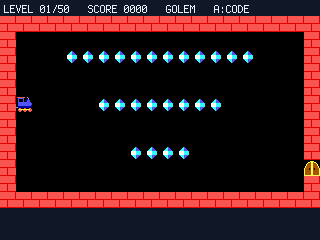
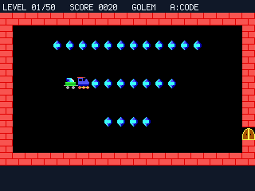
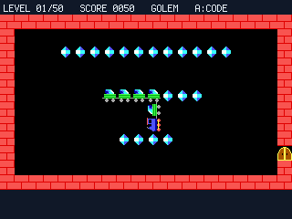
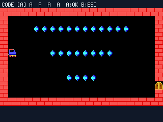

# Train — Snake on Rails

A **logic puzzle** for the PicoPad. Steer a runaway locomotive around a walled yard, sweep up
every gem on the board, and drive the whole train out through the gate — but the loco **never
stops**, and it drags a snake of wagons through every turn you make. **You don't drive it, you
steer it.**

> Genre: logic / puzzle · Players: 1 · Session: 2–10 min · Controls: D-pad + A/B






## The idea
Tap a direction and the locomotive rolls off — and it **keeps rolling on its own**. Every tile it
crosses it lays down a rail, and the wagons behind it chase the head along that trail exactly like a
snake's tail. Roll over a **gem** and it hooks on as a **new wagon**, so the more you collect the
**longer and harder to route** your train becomes.

Clear the board of gems and the **gate swings open**. Drive the head through it and the level is
done. Touch a **wall**, the **shut gate**, or **your own tail** and the level snaps back to the
start — so the whole game is planning a route that threads every gem *and* leaves your growing tail
somewhere safe.

## Quick rules
- **Steer** the loco with the arrows; it moves by itself, one step at a time. You can only change
  its **direction** — you can't stop it or back it up.
- **Collect every gem.** Each one you drive over adds a **wagon** to the tail.
- When the board is clear the **gate opens** — reach it with the loco's head to **finish the level**.
- **Crashing** into a wall, the closed gate, or your own train **restarts the level**.
- **50 levels**, each with its own **5-letter code**. Press **A** any time to type a code and jump
  straight to that level (there's no separate save — the code *is* your progress).

Later levels get tight — a long train through a narrow yard leaves little room to turn.

## Controls
Works on any board with a D-pad + **A** and **B**.

| Input | Action |
|---|---|
| **←/→/↑/↓** | steer the locomotive |
| **A** | open the **level-code** entry (jump to any level) |

While typing a level code, in the top bar:

| Input | Action |
|---|---|
| **↑/↓** | change the highlighted letter |
| **←/→** | move between the five letters |
| **A** | confirm the code |
| **B** | cancel and go back to the level |

## Run it
```sh
python3 sim/run.py games/train/code.py --backend pygame
```
On device, copy `code.py` + `train_levels.py` + `train_tiles.py` into the game slot. The yard fills
the PicoPad's full screen; the game boots **straight into level 1** (no title screen).

## Attribution
Ported to picogame from **PicoLibSDK** by **Miroslav Nemecek** — the original "train" logic puzzle.
All credit for the game and its 50 levels goes to the original author.
