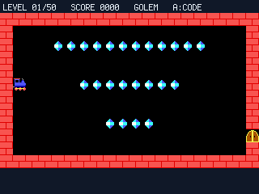
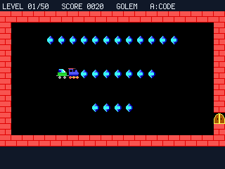
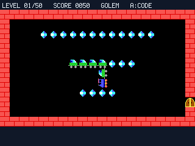
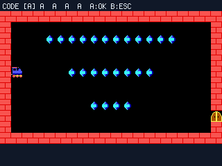

# Train — the Czech classic *Vlak* on a PicoPad

A **logic puzzle** with real pedigree: **Miroslav Němeček's *Vlak*** (Czech for "train"), written in
**1993 for MS-DOS** and passed around on floppies until half a generation of Czech kids knew it by
heart. The whole game was **13 kB** compressed. Three decades later it is still being ported —
this is that game, running on the PicoPad through picogame, with the original **50 levels** and
their five-letter codes intact.

> Genre: logic / puzzle · Players: 1 · Session: 2–10 min · Controls: D-pad + A/B






## The idea
Tap a direction and the locomotive rolls off — and it **keeps rolling on its own**. Every tile it
crosses it lays down a rail, and the wagons behind it chase the head along that trail exactly like a
snake's tail. Roll over an **item** and it hooks on as a **new wagon**, so the more you collect the
**longer and harder to route** your train becomes.

Clear the board and the **gate swings open**. Drive the head through it and the level is done. Touch
a **wall**, the **shut gate**, or **your own tail** and the level snaps back to the start — so the
whole game is planning a route that threads every item *and* leaves your growing tail somewhere
safe. It is Snake turned into a puzzle: nothing is random, every level has a solution, and losing is
always your own routing mistake.

## Quick rules
- **Steer** the loco with the arrows; it moves by itself, one step at a time. You can only change
  its **direction** — you can't stop it or back it up.
- **Collect everything.** Each item you drive over adds a **wagon** to the tail.
- When the board is clear the **gate opens** — reach it with the loco's head to **finish the level**.
- **Crashing** into a wall, the closed gate, or your own train **restarts the level**.
- **50 levels**, each with its own **5-letter code**. Press **A** any time to type a code and jump
  straight to that level (there's no separate save — the code *is* your progress).

Later levels get tight — a long train through a narrow yard leaves little room to turn.

## Controls
Works on any board with a D-pad + **A** and **B**.

| Input | Action |
|---|---|
| **←/→/↑/↓** | steer the locomotive |
| **A** | open the **level-code** entry (jump to any level) |

While typing a level code, in the top bar:

| Input | Action |
|---|---|
| **↑/↓** | change the highlighted letter |
| **←/→** | move between the five letters |
| **A** | confirm the code |
| **B** | cancel and go back to the level |

## Run it
```sh
python3 sim/run.py games/train/code.py --backend pygame
```
On device, copy the whole folder into the game slot — `code.py` and the files next to it. The yard
fills the PicoPad's full screen.

## Where it comes from
*Vlak* was released as **freeware in 1993** by **Miroslav Němeček** and kept growing a following it
was never designed for — DOS releases through 1995, a Windows build in 1999, a Flash remake in 2009,
and today ports to a whole family of small devices (PicoPad, Picoino, DemoVGA, PidiPad, TweetyBoy,
BabyPad and more). In **November 2025** it even reached **Steam**, in a revival by Jiří Křek that
ships the original untouched as *Classic Mode* alongside an *Extended Mode* of new levels. The
author has kept the game **freeware and open source**, free to use commercially or not — which is
why this port can exist at all.

- Author's page (history, downloads, all the ports): <https://www.breatharian.eu/sw/vlak/index_en.html>
- On Steam (2025 revival): <https://store.steampowered.com/app/4122730/>
- Why Czechs remember it: <https://fzone.cz/clanky/ultimatni-retro-na-steam-miri-ceska-hra-vlak-z-roku-1993-9650>

## Attribution
Game design, artwork, the 50 levels and their codes: **© Miroslav Němeček**, released as freeware /
open source. This picogame port follows his **PicoLibSDK** version — the tileset, the 50 levels and
their codes are derived from it; only the rendering and input layer are picogame's. All credit for
the game itself belongs to the original author.
